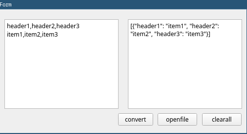

# CSV2JSON

# Demo

Make sure install `pandas`, pandas was used to convert json to csv because I didnt have enough time to implement a function that converts json to csv.

**Tier:** 1-Beginner

In the [JSON2CSV](./JSON2CSV-App.md) application you translated JSON 
to a comma separated value (CSV) format. The objective of CSV2JSON is to 
reverse that process by converting a block of CSV text to JSON.

In CSV2JSON you'll start by copying the JSON2CSV app you created and then
modify it to allow CSV to JSON conversion as well the JSON to CSV conversion
that's already present. In additional to providing a useful function, this
challenge will also give you practice in modifying existing applications to
add new functionality.

### Constraints ###

- Read the user stories below carefully. Some of the functionality created
for JSON2CSV will need to be modified.
- You may not use any libraries or packages designed to perform this type of
conversion.
- Nested JSON structures are not supported.

## User Stories

-   [x] User can paste CSV syntax into a text box
-   [x] User can click a 'Convert to JSON' button to validate the CSV text box and convert it to JSON
-   [x] User can see an warning message if the CSV text box is empty or if it doesn't contain valid CSV
-   [x] User can see the converted CSV in the JSON text box

### Stories already implemented in JSON2CSV 
-   [x] User can paste JSON syntax into a text box
-   [x] User can click a 'Convert to CSV' button to validate the JSON text box and convert it to CSV
-   [x] User can see an warning message if the JSON text box is empty or if it doesn't contain valid JSON
-   [ ] User can click a 'Clear' button to clear the contents of both the JSON and CSV text boxes.

## Bonus features

-   [x] User can enter the path to the CSV file on the local file system in a text box
-   [x] User can click a 'Open CSV' button to load file containing the CSV into the text box
-   [x] User can see a warning message if the CSV file is not found
-   [ ] User can click a 'Save CSV' button to save the CSV file to the file entered in the same text box used for opening the CSV file
-   [x] User can see a warning message if the CSV text box is empty or if the save operation failed.
-   [x] User can enter the path to the JSON file on the local file system in a text box
-   [x] User can click a 'Open JSON' button to load file containing the JSON into the text box
-   [x] User can see a warning message if the JSON file is not found
-   [ ] User can click a 'Save JSON' button to save the JSON file to the  file entered in the same text box used for opening the JSON file
-   [x] User can see a warning message if the JSON text box is empty or if the save operation failed.

## Useful links and resources

- [Comma Separated Values (CSV)](https://en.wikipedia.org/wiki/Comma-separated_values)
- [JavaScript Object Notation (JSON)](https://www.json.org/)
- [Saving a file with pure JS](https://codepen.io/davidelrizzo/pen/cxsGb)
- [Reading files in Javascript](https://codepen.io/jduprey/details/xbale)

## Example projects

- [CSV to JSON Converter](https://codepen.io/JFarrow/pen/CAwyo)
- [JSV Converter](https://gpaiva00.github.io/json-csv)
